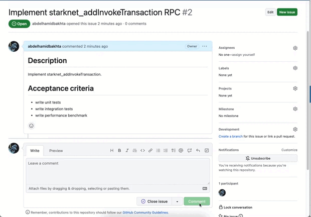

# gh-gpt

Github AI-powered bot 🤖.

[](https://github.com/abdelhamidbakhta/gh-gpt/actions/workflows/test.yml)
[](LICENSE)
[](https://github.com/abdelhamidbakhta/gh-gpt/issues?q=is%3Aissue+is%3Aopen+label%3A%22help+wanted%22)

gh-gpt is a Rust-based command line tool that uses the power of ChatGPT to automate tasks on Github. With gh-gpt, you can automatically add relevant labels to a Github issue, among other tasks.



## Table of Contents

- [gh-gpt](#gh-gpt)
  - [Table of Contents](#table-of-contents)
  - [Installation](#installation)
  - [Configuration](#configuration)
  - [Usage](#usage)
    - [Labelize](#labelize)
  - [Contributing](#contributing)
  - [License](#license)

## Installation

gh-gpt requires a recent version of Rust. You can install Rust through the rustup toolchain installer [here](https://rustup.rs/).

Once Rust is installed, you can install gh-gpt using Cargo:

```bash
cargo install gh-gpt
```

## Configuration

gh-gpt uses `dotenv` to automatically load environment variables from a `.env` file. You can also set these variables manually in your environment. Here is an example of the configuration variables used:

```bash
# Github
GH_GPT_GITHUB_TOKEN="..."
GH_GPT_OPENAI_API_KEY="..."

# OpenAI
GH_GPT_CHATGPT_MODEL="gpt-4"
GH_GPT_CHATGPT_MAX_TOKENS="4096"
```

Replace the "..." with your actual tokens and preferences.

## Usage

gh-gpt currently supports the following commands:

- `labelize` - Automatically add relevant labels to a Github issue.
- `help` - Print help message or the help of the given subcommand(s).

You can view help for the CLI tool with:

```bash
    gh-gpt help
```

### Labelize

To automatically add relevant labels to a Github issue, use the `labelize` command:

```bash
gh-gpt labelize [repo_owner] [repo_name] [issue_number]
```

For example, to labelize issue #1 of [keep-starknet-strange/madara](https://github.com/keep-starknet-strange/madara) you would run:

```bash
RUST_LOG=info gh-gpt labelize keep-starknet-strange madara 1
```

## Contributing

Contributions to gh-gpt are welcomed! Feel free to submit a pull request or create an issue.

## License

gh-gpt is licensed under the [MIT License](LICENSE).
