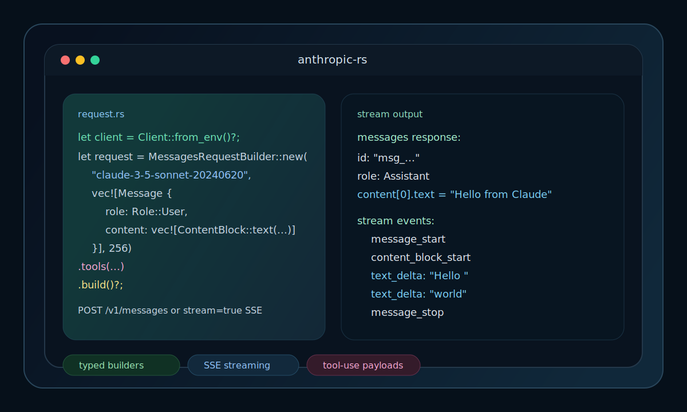

<div align="center">

# anthropic-rs

Typed async Rust client for Anthropic's Messages API with structured requests, SSE streaming, and tool-use payloads.

<p>
  <a href="https://crates.io/crates/anthropic"></a>
  <a href="https://docs.rs/anthropic"></a>
  <a href="./LICENSE"></a>
  
  
  
</p>



</div>

## How It Works

```text
Prompt / image blocks / tool schema
                |
                v
+-------------------------------------------+
| MessagesRequestBuilder                    |
| model | max_tokens | temperature | tools  |
+---------------------------+---------------+
                            | build()
                            v
+-------------------------------------------+
| Client / ClientBuilder                    |
| env | headers | timeout | backoff         |
+---------------+-------------------+-------+
                |                   |
                | messages()        | messages_stream()
                v                   v
     POST /v1/messages      POST /v1/messages + stream=true
                |                   |
                v                   v
+-------------------------+  +-----------------------------+
| MessagesResponse        |  | MessagesStreamEvent         |
| content | usage | stop  |  | start | delta | stop        |
+-------------------------+  +-----------------------------+

429 responses are retried with exponential backoff before surfacing an error.
```

## 3-Step Quick Start

1. Clone the repo.

```bash
git clone https://github.com/AbdelStark/anthropic-rs.git
cd anthropic-rs
```

2. Export your API key.

```bash
export ANTHROPIC_API_KEY="sk-ant-..."
```

3. Run the basic example.

```bash
cargo run --manifest-path examples/basic-messages/Cargo.toml
```

Expected output:

```text
messages response:
MessagesResponse {
    id: "msg_...",
    message_type: "message",
    role: Assistant,
    content: [
        Text {
            text: "Hello ...",
        },
    ],
    usage: Usage {
        input_tokens: ...,
        output_tokens: ...,
    },
}
```

## The Good Stuff

### 1. Send one typed message

```rust
use anthropic::types::{ContentBlock, Message, MessagesRequestBuilder, Role};
use anthropic::Client;

let client = Client::from_env()?;
let request = MessagesRequestBuilder::new(
    "claude-3-5-sonnet-20240620",
    vec![Message {
        role: Role::User,
        content: vec![ContentBlock::text("Summarize this diff in one sentence.")],
    }],
    256,
)
.temperature(0.2)
.build()?;

let response = client.messages(request).await?;
```

- `model` selects the Anthropic model.
- `max_tokens` caps output length.
- `temperature(0.2)` keeps output tighter and less varied.

### 2. Stream text as it arrives

```rust
use anthropic::types::{ContentBlock, ContentBlockDelta, Message, MessagesRequestBuilder, MessagesStreamEvent, Role};
use anthropic::Client;
use tokio_stream::StreamExt;

let client = Client::from_env()?;
let request = MessagesRequestBuilder::new(
    "claude-3-5-sonnet-20240620",
    vec![Message {
        role: Role::User,
        content: vec![ContentBlock::text("Stream a short release note.")],
    }],
    128,
)
.build()?;

let mut stream = client.messages_stream(request).await?;

while let Some(event) = stream.next().await {
    if let Ok(MessagesStreamEvent::ContentBlockDelta {
        delta: ContentBlockDelta::TextDelta { text },
        ..
    }) = event
    {
        print!("{text}");
    }
}
```

- `messages_stream()` forces `stream=true` and yields typed SSE events.
- Match `ContentBlockDelta::TextDelta` when you only care about visible text.
- The `examples/streaming-messages` helper rebuilds the final assistant message from start, delta, and stop events.

### 3. Ask for tool input instead of plain text

```rust
use anthropic::types::{ContentBlock, Message, MessagesRequestBuilder, Role, Tool, ToolChoice};
use serde_json::json;

let request = MessagesRequestBuilder::new(
    "claude-3-5-sonnet-20240620",
    vec![Message {
        role: Role::User,
        content: vec![ContentBlock::text("What's the weather in Paris?")],
    }],
    256,
)
.tools(vec![Tool {
    name: "get_weather".into(),
    description: "Fetch current weather for a city.".into(),
    input_schema: json!({
        "type": "object",
        "properties": {
            "city": { "type": "string" }
        },
        "required": ["city"]
    }),
}])
.tool_choice(ToolChoice::Any)
.build()?;
```

- `tools(...)` registers callable tool schemas.
- `tool_choice(ToolChoice::Any)` tells the model it may call a tool.
- Tool results round-trip through `ContentBlock::ToolUse` and `ContentBlock::ToolResult`.

## Configuration

### Environment

| Variable | Default | Description |
| --- | --- | --- |
| `ANTHROPIC_API_KEY` | none | Required API key used for the `x-api-key` header. |
| `ANTHROPIC_API_BASE` | `https://api.anthropic.com` | Override the API base URL. |
| `ANTHROPIC_API_VERSION` | `2023-06-01` | Sets the `anthropic-version` header. |
| `ANTHROPIC_BETA` | none | Optional `anthropic-beta` header for beta features. |
| `ANTHROPIC_TIMEOUT_SECS` | `60` | Request timeout in seconds when building from env. |

### Core API

| Call | Returns | Notes |
| --- | --- | --- |
| `Client::new(api_key)` | `Result<Client, AnthropicError>` | Manual setup when you do not want env-based config. |
| `Client::from_env()` | `Result<Client, AnthropicError>` | Reads the environment variables above. |
| `client.messages(request)` | `Result<MessagesResponse, AnthropicError>` | Rejects `stream=true` requests. |
| `client.messages_stream(request)` | `Result<MessagesResponseStream, AnthropicError>` | Opens an SSE stream and yields typed events. |
| `ClientBuilder::backoff(...)` | `ClientBuilder` | Customizes retry behavior for cloneable requests. |

## Deployment / Integration

Use the example crate as a CI smoke test inside GitHub Actions:

```yaml
name: anthropic-smoke

on:
  workflow_dispatch:

jobs:
  basic-messages:
    runs-on: ubuntu-latest
    steps:
      - uses: actions/checkout@v4
      - uses: dtolnay/rust-toolchain@stable
      - run: cargo run --manifest-path examples/basic-messages/Cargo.toml
        env:
          ANTHROPIC_API_KEY: ${{ secrets.ANTHROPIC_API_KEY }}
```

That exercises `Client::from_env()`, request building, and `/v1/messages` end to end.

## Contributors ✨

Thanks goes to these wonderful people ([emoji key](https://allcontributors.org/docs/en/emoji-key)):

<!-- ALL-CONTRIBUTORS-LIST:START - Do not remove or modify this section -->
<!-- prettier-ignore-start -->
<!-- markdownlint-disable -->
<table>
  <tbody>
    <tr>
      <td align="center" valign="top" width="16.66%"><a href="https://github.com/AbdelStark"><br /><sub><b>A₿del ∞/21M 🐺 - 🐱</b></sub></a><br /><a href="https://github.com/AbdelStark/anthropic-rs/commits?author=AbdelStark" title="Code">💻</a></td>
      <td align="center" valign="top" width="16.66%"><a href="https://github.com/ofalvai"><br /><sub><b>ofalvai</b></sub></a><br /><a href="https://github.com/AbdelStark/anthropic-rs/commits?author=ofalvai" title="Code">💻</a></td>
      <td align="center" valign="top" width="16.66%"><a href="https://github.com/JohnAllen"><br /><sub><b>JohnAllen</b></sub></a><br /><a href="https://github.com/AbdelStark/anthropic-rs/commits?author=JohnAllen" title="Code">💻</a></td>
      <td align="center" valign="top" width="16.66%"><a href="https://github.com/Philipp-M"><br /><sub><b>Philipp-M</b></sub></a><br /><a href="https://github.com/AbdelStark/anthropic-rs/commits?author=Philipp-M" title="Code">💻</a></td>
      <td align="center" valign="top" width="16.66%"><a href="https://github.com/wyatt-avilla"><br /><sub><b>wyatt-avilla</b></sub></a><br /><a href="https://github.com/AbdelStark/anthropic-rs/commits?author=wyatt-avilla" title="Code">💻</a></td>
      <td align="center" valign="top" width="16.66%"><a href="https://github.com/aoikurokawa"><br /><sub><b>aoikurokawa</b></sub></a><br /><a href="https://github.com/AbdelStark/anthropic-rs/commits?author=aoikurokawa" title="Code">💻</a></td>
    </tr>
  </tbody>
</table>
<!-- markdownlint-restore -->
<!-- prettier-ignore-end -->

<!-- ALL-CONTRIBUTORS-LIST:END -->

This project follows the [all-contributors](https://allcontributors.org) specification. Contributions of any kind welcome!
